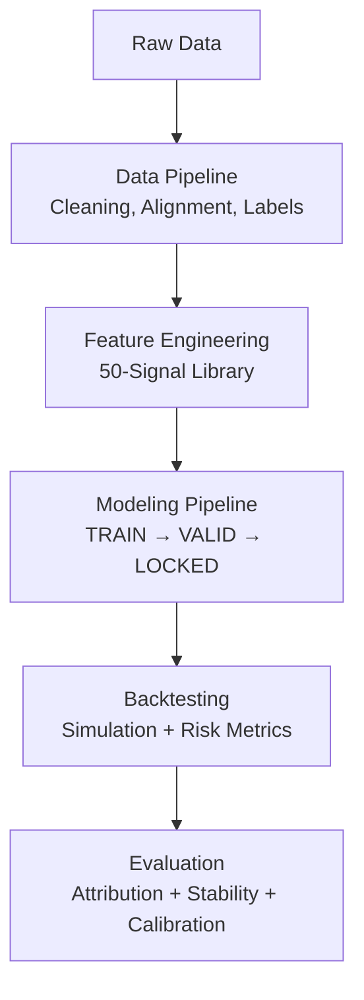

# Systematic Multi‑Signal Equity Strategy


**Quanta Fellowship — Final Research Project**

**Author:** Kate Mason

**Report length:** 37 pages

**Signals:** 50 engineered features

**Research protocol:** TRAIN → VALIDATION → LOCKED → HOLDOUT

## Overview

This repository contains a full research workflow for designing and validating a **50‑signal systematic equity strategy**, combining time‑series features, cross‑sectional factors, and engineered signals. The emphasis is on **clean methodology**, **uncertainty‑aware evaluation**, and **production‑minded reproducibility**.

## What the report covers

- Feature engineering across price-based, volatility-based, and cross-sectional signals
- A strict TRAIN → VALIDATION → LOCKED → HOLDOUT pipeline (leakage-aware)
- Robustness checks and stability analysis across regimes
- Signal attribution and factor contribution decomposition
- A reproducible, modular workflow aligned with production quant research standards

## Key contributions

### 1) 50‑Signal Factor Library
Signals spanning momentum, mean reversion, volatility, microstructure, and cross‑sectional spreads.

### 2) Clean Backtesting Framework
Leakage‑controlled evaluation with locked hyperparameters and blind holdout testing.

### 3) Uncertainty‑Aware Modeling
Focus on stability, calibration, and robustness rather than point estimates alone.

### 4) Reproducible Workflow
Modular Python pipeline for data cleaning, feature generation, modeling, and evaluation.

## Methodology summary

### Data pipeline
- Structured raw equity data ingestion
- Cleaning, alignment, validation, labeling
- 50 engineered signals with documented formulas

### Modeling framework
- Regression‑based forecasting
- Ensemble aggregation of signals
- Bayesian calibration for uncertainty estimation

### Evaluation
- Rolling-window backtests
- Risk-adjusted metrics (Sharpe, Sortino, max drawdown)
- Stability and sensitivity analysis
- Factor attribution and contribution analysis

## Repository structure

```text
/data/                  # Sample data or schema (no proprietary data)
/data/raw/              # Place raw CSV/Parquet here (not committed)
/notebooks/             # Exploratory analysis + signal R&D
/src/
  data_pipeline.py
  feature_engineering.py
  model_training.py
  backtesting.py
  evaluation.py
/report/
  quanta_final_project.pdf
README.md

```
## Pipeline overview


## Full report
Download the full PDF
https://drive.google.com/file/d/1zB8wxuE_tIqYUH_F0FdNuTWCa82Fj1Gj/view?usp=sharing
## Why this project matters
This work demonstrates empirical rigor, first‑principles modeling, clean validation methodology, and production‑ready research practices—especially around avoiding leakage, stress‑testing stability, and incorporating uncertainty.
## How to run
1) Install dependencies
```bash
pip install -r requirements.txt
```
2) Prepare data
Place your raw files in:
```text
/data/raw/
```
3) Run the pipeline
```bash
python -m src.data_pipeline
python -m src.feature_engineering
python -m src.model_training
python -m src.backtesting
python -m src.evaluation
```
4) Notebooks (optional)

Open the notebooks in ./notebooks/ for exploratory analysis, signal research, and visualizations.
